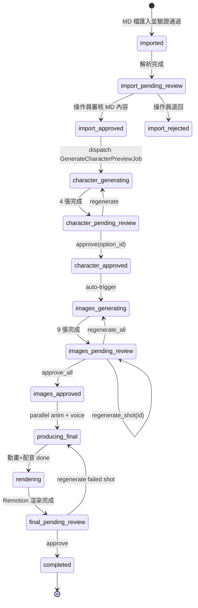

# Project Brief: Building Company AI Video Automation Tool
## (Optimized for Claude Code) — v2 Architecture

> **重大架構變更**：v2 的腳本生成 + 4 Reviewer 審查由 **Cowork（Claude）端負責**，產出標準格式 MD 檔。Laravel app 只負責 **MD 匯入 → AI 圖/動畫/配音/渲染**。詳見 §2.4 工作分工。

---

## 🤖 How to Read This Brief

**You are Claude Code, working in the directory `~/Desktop/aivideo/`.**

Follow this exact procedure:

1. **Read this entire file first.** Do not skim.
2. After reading, **list back to me in 5 bullets** what you understood the project to be. If anything seems contradictory, stop and ask.
3. Then **read these supporting files** (in this order):
   - `09_腳本參考/14_MD_Schema.md` — 標準 MD 格式定義（核心）
   - `09_腳本參考/15_松竹敦富_30秒_標準格式.md` — 範例可匯入 MD
   - `09_腳本參考/02_Reviewers.md` — Reviewer 系統 prompt（**已不在 Laravel 範圍內，但理解這個流程有助於你理解 review.passed 從哪來**）
   - `09_腳本參考/09_接案SOP_v2.0_踩坑筆記.md` — 已知技術坑（必看）
4. Begin **Phase 1: Architecture Review** (see §13). Do NOT write code yet.
5. After I approve the review, proceed phase-by-phase, getting explicit approval before each phase.

**Tone**: Be direct and opinionated. Push back on anything you disagree with.

**Code style**: Strict types, single responsibility, no premature abstraction. Match Laravel conventions. PSR-12. Use Pest for tests.

**Cost discipline**: ALL external API calls MUST go through stub/mock by default. Real API calls only behind `APP_USE_REAL_APIS=true` env flag.

---

## 📑 Table of Contents

1. TL;DR
2. Project Context (含工作分工表)
3. Tech Stack
4. State Machine
5. External APIs（v2：Azure TTS、Flux Kontext、Kling 2.5 Turbo、Remotion）
6. Critical Pitfalls
7. Database Schema
8. Frontend Wizard Pages
9. Job Architecture
10. Mock/Stub Strategy
11. Definition of Done
12. Constraints & Anti-Patterns
13. Phased Implementation Plan
14. Open Questions
15. Personal Context
16. Success Criteria

---

## 1. TL;DR

I'm a Laravel + Vue developer building an internal-only tool to automate AI-generated marketing videos for Taiwanese building companies.

**v2 架構**：
- **Cowork（不開發）端**：對話式產腳本 + 4 Reviewer 並行審查 + v2 修正 → 輸出標準 MD 檔
- **Laravel app（要開發）端**：MD 匯入 → 角色預覽（Flux Pro）→ 場景圖（Flux Kontext + Ideogram for 中文）→ 動畫（Kling 2.5 Turbo）→ 配音（Azure TTS 免費）→ 自動渲染（Remotion Lambda）

**4 個 Operator 審核 checkpoint**：MD 匯入後檢視 → 角色 → 場景 → 最終成品。

**目標成本**：~$2.50 / 影片
**目標時間**：~1 小時 operator 操作 + ~15 分鐘背景 AI 處理

---

## 2. Project Context

### 2.1 What it does (v2)
For each new building project, the operator runs through this wizard:

```
Stage 0  [Cowork 端] 對話 → 產 MD 檔（含 Review 通過記錄）
   ↓ 下載 .md 檔
Stage 1  [Laravel 端] 匯入 MD 檔 → 解析 → 建立 Case + Shots
   ⏸ CHECKPOINT 1: 操作員看 MD 內容 + 審查報告，approve/reject
Stage 2  自動：產 4 張角色預覽（Flux Pro v1.1）
   ⏸ CHECKPOINT 2: 操作員選一張 OR 重產
Stage 3  自動：產 9 張場景圖（Flux Kontext 或 Ideogram，依 use_model 欄位）
   ⏸ CHECKPOINT 3: 操作員 approve all OR 重產特定鏡頭
Stage 4  自動：並行 Kling 動畫 + Azure TTS 配音
Stage 5  自動：Remotion Lambda 渲染最終 mp4
   ⏸ CHECKPOINT 4: 操作員預覽成品 → 通過 OR 退回某階段
```

### 2.2 Why
Currently each video requires 6-8 hours of manual operation. Even after v2 automation, ~1 hour operator time + 15 min background processing.

### 2.3 Scope boundaries
- ✅ Single internal operator
- ✅ Internal network deployment
- ✅ One project at a time (concurrent nice-to-have)
- ❌ NOT included: 腳本生成、4 Reviewer、v2 修正（這部分在 Cowork 端做完才匯入）
- ❌ NOT included: Payment, customer accounts, multi-tenant
- ❌ NOT included: Mobile app

### 2.4 工作分工表

| 環節 | Cowork（不開發）| Laravel app（你要開發）|
|---|---|---|
| 收集案件資料 | ✅ 對話收集 | ❌ |
| 寫 v1 腳本 | ✅ Claude Sonnet | ❌ |
| 4 Reviewer 並行審查 | ✅ 4 個 Claude Haiku 並行 | ❌ |
| v2 修正版 | ✅ Claude Sonnet | ❌ |
| 產 MD 檔 | ✅ 標準 schema | ❌ |
| **MD 匯入解析** | ❌ | ✅ |
| **角色預覽 4 張** | ❌ | ✅ Flux Pro v1.1 |
| **場景圖 9 張** | ❌ | ✅ Flux Kontext / Ideogram |
| **角色裝飾圖** | ❌ | ✅ Flux Kontext |
| **動畫 9-11 段** | ❌ | ✅ Kling 2.5 Turbo / Luma |
| **配音** | ❌ | ✅ Azure TTS zh-TW |
| **自動渲染合成** | ❌ | ✅ Remotion Lambda |
| **存放最終 mp4** | ❌ | ✅ R2 → 通知 |

---

## 3. Tech Stack

### 3.1 Required (non-negotiable)

| Layer | Tool | Notes |
|---|---|---|
| Backend | Laravel 11 | I'm fluent in it |
| Frontend | Vue 3 + Composition API | I prefer this over Options API |
| Build | Vite | Standard with Laravel 11 |
| Styling | Tailwind CSS | Latest |
| Database | MySQL 8 OR PostgreSQL 16 | Open to your recommendation |
| Queue | Redis + Horizon | Required for async jobs |
| Real-time | Laravel Reverb + Echo | For wizard progress updates |
| Storage | Cloudflare R2 (S3-compat) | Already provisioned |
| Auth | Sanctum (single password) | Internal use |
| **Video render** | **Remotion Lambda (AWS)** | **新增：自動渲染影片** |

### 3.2 Recommended

| Concern | Package |
|---|---|
| DTO | `spatie/laravel-data` |
| YAML parsing | `symfony/yaml`（解析 MD frontmatter）|
| Async coordination | `Bus::batch` (built-in) |
| HTTP client | `Http` facade (built-in) |
| Tests | `pestphp/pest` |
| Debugging | `laravel/telescope`, `laravel/pail` |

### 3.3 Anti-stack

- ❌ Inertia.js — clean SPA + API split preferred
- ❌ Filament
- ❌ TypeScript on frontend
- ❌ Custom design systems

---

## 4. State Machine (v2)



**重要**：v1 的 `draft → script_generating → script_pending_review → script_approved` 全部刪除。
腳本由 Cowork 端產出，Laravel 直接從 `imported` 開始。

---

## 5. External APIs (v2)

### 5.1 fal.ai

**Endpoints**:
- **Flux Pro v1.1**: `fal-ai/flux-pro/v1.1` — 角色預覽 4 張
- **Flux Kontext**: `fal-ai/flux-pro/kontext` ⭐ **新增**：場景圖（帶角色參考）+ 角色裝飾圖
- **Ideogram v2 turbo**: `fal-ai/ideogram/v2/turbo` ⭐ **新增**：中文渲染鏡頭
- **Kling V2.5 Turbo std**: `fal-ai/kling-video/v2.5-turbo/standard/image-to-video` ⭐ **升級**：取代 1.6
- **Luma Ray2**: `fal-ai/luma-dream-machine/ray-2` — 環繞運鏡（S04、S07）

**Sample Flux Kontext call** (帶角色參考，取代 LoRA 訓練)：
```php
$response = Http::withToken(config('services.fal.key'))
    ->post('https://queue.fal.run/fal-ai/flux-pro/kontext', [
        'prompt' => $shot->image_prompt,
        'image_url' => $case->approved_character_url,  // R2 簽名 URL
        'guidance_scale' => 3.5,
        'num_inference_steps' => 28,
        'aspect_ratio' => '9:16',
        'webhook_url' => route('webhooks.fal.image', ['shot' => $shot->id]),
    ]);
```

**Sample Ideogram call** (中文渲染專用)：
```php
$response = Http::withToken(config('services.fal.key'))
    ->post('https://queue.fal.run/fal-ai/ideogram/v2/turbo', [
        'prompt' => $shot->image_prompt,
        'aspect_ratio' => '9:16',
        'style' => 'auto',
        'expand_prompt' => false,
        'webhook_url' => route('webhooks.fal.image', ['shot' => $shot->id]),
    ]);
```

**Approx cost**: $1.16 per video (角色 0.16 + 場景 0.36 + 裝飾 0.08 + 動畫 1.89 - $1.33 if Luma)

### 5.2 Azure Cognitive Services TTS ⭐ 取代 ElevenLabs

**Endpoint**: `POST https://{region}.tts.speech.microsoft.com/cognitiveservices/v1`

**Voice IDs** (台灣腔 Neural):
- `zh-TW-HsiaoChenNeural` — 女聲，溫暖（推薦）
- `zh-TW-HsiaoYuNeural` — 女聲，活潑
- `zh-TW-YunJheNeural` — 男聲，沉穩

```php
$ssml = <<<XML
<speak version='1.0' xmlns='http://www.w3.org/2001/10/synthesis' xml:lang='zh-TW'>
    <voice name='{$voiceId}'>
        <prosody rate='1.0' pitch='0%'>
            {$text}
        </prosody>
    </voice>
</speak>
XML;

$response = Http::withHeaders([
    'Ocp-Apim-Subscription-Key' => config('services.azure.tts_key'),
    'Content-Type' => 'application/ssml+xml',
    'X-Microsoft-OutputFormat' => 'audio-24khz-96kbitrate-mono-mp3',
])->withBody($ssml, 'application/ssml+xml')
  ->post("https://{$region}.tts.speech.microsoft.com/cognitiveservices/v1");
```

**Free tier**: 每月 50 萬字（Neural Voices）→ 跑 2,500 支影片夠用
**Approx cost**: $0 / video

**重要**：傳入文字前先把阿拉伯數字轉中文（避免「11 樓」讀成「eleven 樓」）。

### 5.3 Remotion Lambda ⭐ 新增（自動渲染）

**Setup**: 寫 React 影片模板 + 部署 AWS Lambda render farm

```typescript
// remotion/src/CaseVideo.tsx
import { Composition, AbsoluteFill, Audio, Sequence, Img, Video } from 'remotion';

export const CaseVideo: React.FC<{ caseData: CaseData }> = ({ caseData }) => {
  return (
    <AbsoluteFill>
      <Audio src={caseData.voiceover_url} />
      <Audio src={caseData.bgm_url} volume={0.15} />
      
      {caseData.shots.map((shot, i) => (
        <Sequence key={shot.id} from={shot.start_frame} durationInFrames={shot.duration_frames}>
          <Video src={shot.video_url} />
          <Subtitle text={shot.subtitle} />
          {shot.needs_post_text && <PostText config={shot.post_text} />}
          <ComplianceWatermark text={caseData.compliance_watermark} />
        </Sequence>
      ))}
      
      <BrandCard config={caseData.brand_card} from={brandCardFrame} />
      <CtaCard config={caseData.cta_card} from={ctaCardFrame} />
    </AbsoluteFill>
  );
};
```

**Render via Lambda**:
```php
// Trigger render from Laravel
$response = Http::withToken(config('services.remotion.key'))
    ->post(config('services.remotion.lambda_url'), [
        'composition' => 'CaseVideo',
        'inputProps' => $caseData->toArray(),
        'outName' => "case_{$case->id}.mp4",
    ]);
```

**Approx cost**: ~$0.05 per video (60s, 1080×1920 @ 30fps)

### 5.4 Webhook Security (HMAC) — 同前

```php
public function handle(Request $request, Closure $next)
{
    $signature = $request->header('X-Fal-Signature');
    $expected = hash_hmac('sha256', $request->getContent(), config('services.fal.webhook_secret'));
    if (!hash_equals($expected, $signature)) abort(401);
    return $next($request);
}
```

---

## 6. Critical Pitfalls

(沿用 v1 brief，以下重點重申)

### 6.1 Character consistency drift
**v2 解法**：使用 Flux Kontext + 操作員核准的角色圖當 reference image，免訓練 LoRA。

### 6.2 Aspect ratio
- DO NOT include `--ar 9:16` in prompts
- USE `aspect_ratio: '9:16'` parameter

### 6.3 Pixar style vs photorealistic collision
Triple-enforcement at top of prompt（已寫進 MD schema）。

### 6.4 Element omission
Reorder prompt — important secondary subject first。

### 6.5 Chinese text rendering
**v2 解法**：中文鏡頭使用 Ideogram v2 turbo（成功率 70-80%）+ CapCut 後製為備援。

### 6.6 Kling timing variance
- Webhook callback 主要
- Cron polling 30s 備援
- 5 min 無回應 → resubmit (max 3 retries)

### 6.7 Taiwan advertising compliance
**v2 解法**：Cowork 端的 Reviewer 3 在腳本生成階段已過濾。Laravel 端只信任 `review.passed = true` 的 MD。

### 6.8 Number/character mixing in Mandarin TTS
Pre-process voiceover text 把阿拉伯數字轉中文。

---

## 7. Database Schema (v2)

```sql
-- Main case entity（簡化版，移除 script-related fields）
CREATE TABLE building_cases (
    id CHAR(36) PRIMARY KEY,
    
    -- 從 MD 匯入的 metadata
    case_id_slug VARCHAR(64) UNIQUE NOT NULL,    -- MD 裡的 case_id
    schema_version VARCHAR(8) NOT NULL DEFAULT '1.0',
    project_name VARCHAR(255) NOT NULL,
    builder_name VARCHAR(255),
    location VARCHAR(255),
    area_range VARCHAR(64),
    price_range VARCHAR(64),
    target_audience VARCHAR(64),
    tone VARCHAR(64),
    video_length_seconds SMALLINT NOT NULL,
    aspect_ratio VARCHAR(8) NOT NULL,
    platforms JSON,
    
    -- 角色
    character_dna TEXT NOT NULL,
    character_nickname VARCHAR(64),
    approved_character_id CHAR(36) NULL,
    
    -- 配音
    voice_id_preferred VARCHAR(64) NOT NULL,
    voiceover_full TEXT NOT NULL,
    voiceover_url VARCHAR(512) NULL,
    
    -- 品牌卡 / CTA 卡（JSON 存放）
    brand_card JSON,
    cta_card JSON,
    
    -- 合規
    compliance_watermark TEXT,
    compliance_footer JSON,
    shot_disclaimers JSON,
    
    -- BGM
    bgm_keywords JSON,
    
    -- Review 證明（從 MD 帶來）
    review_passed BOOLEAN NOT NULL DEFAULT FALSE,
    review_v2_score DECIMAL(3, 1),
    review_meta JSON,
    
    -- 狀態
    status VARCHAR(64) NOT NULL DEFAULT 'imported',
    status_message TEXT NULL,
    
    -- 成本
    cost_usd DECIMAL(10, 4) NOT NULL DEFAULT 0,
    
    -- 交付
    final_video_url VARCHAR(512) NULL,
    drive_folder_url VARCHAR(512) NULL,
    
    -- 原始 MD 留存（debugging + audit）
    original_md TEXT NOT NULL,
    
    created_at TIMESTAMP DEFAULT CURRENT_TIMESTAMP,
    updated_at TIMESTAMP DEFAULT CURRENT_TIMESTAMP ON UPDATE CURRENT_TIMESTAMP,
    completed_at TIMESTAMP NULL,
    
    INDEX idx_status (status)
);

-- Shots（沿用，但 use_model 改 enum）
CREATE TABLE shots (
    id CHAR(36) PRIMARY KEY,
    case_id CHAR(36) NOT NULL,
    shot_id VARCHAR(8) NOT NULL,
    shot_order TINYINT NOT NULL,
    duration_seconds DECIMAL(4, 1),
    
    use_model ENUM('flux_pro', 'flux_kontext', 'flux_lora', 'ideogram_v2_turbo', 'recraft_v3') NOT NULL,
    image_prompt TEXT NOT NULL,
    image_settings JSON,
    
    needs_animation BOOLEAN DEFAULT TRUE,
    kling_prompt TEXT,
    kling_settings JSON,
    
    voiceover TEXT,
    subtitle TEXT,
    emotion VARCHAR(64),
    
    needs_post_text BOOLEAN DEFAULT FALSE,
    post_text JSON,
    needs_sound_effect BOOLEAN DEFAULT FALSE,
    sound_effect VARCHAR(64),
    
    image_url VARCHAR(512) NULL,
    image_request_id VARCHAR(128) NULL,
    image_status ENUM('pending', 'processing', 'done', 'failed') DEFAULT 'pending',
    image_retry_count TINYINT DEFAULT 0,
    image_cost_usd DECIMAL(10, 4) DEFAULT 0,
    
    video_url VARCHAR(512) NULL,
    video_request_id VARCHAR(128) NULL,
    video_status ENUM('pending', 'processing', 'done', 'failed') DEFAULT 'pending',
    video_retry_count TINYINT DEFAULT 0,
    video_cost_usd DECIMAL(10, 4) DEFAULT 0,
    
    is_approved BOOLEAN DEFAULT FALSE,
    
    FOREIGN KEY (case_id) REFERENCES building_cases(id) ON DELETE CASCADE,
    UNIQUE KEY uk_case_shot (case_id, shot_id)
);

-- 角色裝飾圖（給品牌卡用）— 結構同 shots 但語意不同
CREATE TABLE decorative_assets (
    id CHAR(36) PRIMARY KEY,
    case_id CHAR(36) NOT NULL,
    asset_id VARCHAR(64) NOT NULL,    -- "deco_a_welcome"
    use_model VARCHAR(32),
    image_prompt TEXT,
    kling_prompt TEXT,
    placement VARCHAR(8),              -- "S10" / "S11"
    placement_position VARCHAR(32),
    needs_chroma_key BOOLEAN DEFAULT TRUE,
    image_url VARCHAR(512) NULL,
    video_url VARCHAR(512) NULL,
    status ENUM('pending', 'processing', 'done', 'failed') DEFAULT 'pending',
    
    FOREIGN KEY (case_id) REFERENCES building_cases(id) ON DELETE CASCADE
);

-- character_options（沿用）
-- voiceovers（沿用）
-- case_status_history（沿用）
```

---

## 8. Frontend Wizard Pages (v2)

| Route | Purpose | Approval action |
|---|---|---|
| `/cases` | 案件列表 | — |
| `/cases/import` | **匯入 MD 檔**（取代 /new）| Upload .md → 解析 → preview |
| `/cases/{id}/review-import` | 看 MD 內容 + Review 報告 | Approve(進下一步) OR Reject |
| `/cases/{id}/character` | 4 張角色預覽 | Approve(option_id) OR Regenerate |
| `/cases/{id}/images` | 9 張場景 grid | Approve all OR Regenerate shot(s) |
| `/cases/{id}/final` | 完整 mp4 預覽 | Mark complete OR Regenerate failed |

**Real-time strategy**: 同 v1，Reverb broadcasts CaseStatusChanged / ShotImageGenerated / ShotAnimationCompleted / VideoRendered。

---

## 9. Job Architecture (v2)

| Job | Trigger | Concurrency | Retries |
|---|---|---|---|
| `ImportMdCaseJob` | POST /api/cases/import | Single | 1 |
| `GenerateCharacterPreviewJob` | Import approved | 4 parallel (Bus::batch) | 2 |
| `GenerateImagesBatchJob` | Character approved | Dispatcher | — |
| `GenerateSingleImageJob` | Per shot (loop dispatched) | 3 parallel max | 3 |
| `RegenerateSingleImageJob` | Operator request | 1 | 3 |
| `GenerateDecorativeAssetJob` | Character approved (parallel with images) | 2 parallel | 2 |
| `SubmitAnimationJob` | Images approved | 3 parallel max | 1 |
| `PollAnimationStatusJob` | After submit + cron fallback | Single per request | 60 |
| `GenerateVoiceJob` | Images approved (parallel with anim) | Single | 2 |
| `RenderFinalVideoJob` | Animations + voice all done | Single | 2 |
| `FinalizeCaseJob` | Render complete | Single | 1 |

**移除的 v1 jobs**：
- ❌ `GenerateScriptJob` (Cowork 處理)
- ❌ `RunReviewerJob` (Cowork 處理)
- ❌ `GenerateScriptV2Job` (Cowork 處理)

**新增的 v2 jobs**：
- ✅ `ImportMdCaseJob` — 解析 YAML frontmatter，建 Case + Shots + DecorativeAssets
- ✅ `GenerateDecorativeAssetJob` — 給 S10/S11 用的角色裝飾圖
- ✅ `RenderFinalVideoJob` — 觸發 Remotion Lambda

---

## 10. Mock/Stub Strategy

同 v1，但新增 stubs：

```php
interface AzureTtsServiceContract { ... }
class StubAzureTtsService implements AzureTtsServiceContract {
    public function synthesize(string $text, string $voiceId): string {
        return Storage::disk('local')->get('fixtures/sample_voiceover.mp3');
    }
}

interface RemotionRenderServiceContract { ... }
class StubRemotionRenderService implements RemotionRenderServiceContract {
    public function renderCase(BuildingCase $case): string {
        return Storage::disk('local')->url('fixtures/sample_final_video.mp4');
    }
}
```

---

## 11. Definition of Done (per phase)

### Phase 1: Architecture Review
- [ ] 你已經發現 3+ 個我 brief 的風險/漏洞
- [ ] 提出 1+ 個我沒提到的架構建議
- [ ] 回答 §14 所有 open question
- [ ] 我們對 iteration order 有共識

### Phase 2: Project Setup + MD Import
- [ ] composer + npm 完成
- [ ] migrations 跑通
- [ ] MD 匯入 service 寫好（YAML 解析 + 驗證）
- [ ] 用 `15_松竹敦富_30秒_標準格式.md` 測試成功匯入
- [ ] Pest 測試覆蓋 import service ≥ 80%

### Phase 3: AI Service Integration
- [ ] FalAiService 支援 Flux Pro / Flux Kontext / Ideogram 三種 endpoint
- [ ] AzureTtsService 中文 + 數字預處理
- [ ] R2StorageService 上傳 + 簽名 URL
- [ ] 全部都有 stub + Pest 測試

### Phase 4: Job Implementation
- [ ] 11 個 job 完成
- [ ] Bus::batch 跑通 4 角色預覽 + 9 場景圖
- [ ] Kling polling: webhook + cron fallback 都驗證
- [ ] 失敗路徑測試

### Phase 5: Frontend
- [ ] 5 個 wizard 頁面完成
- [ ] Reverb broadcast 接收 + UI 更新
- [ ] 單張重產功能在 /images 頁面

### Phase 6: Remotion Render
- [ ] Remotion 專案建立
- [ ] Composition 元件寫好（場景 + 字幕 + 浮水印 + 品牌卡 + CTA）
- [ ] Lambda 部署
- [ ] 從 Laravel 觸發 render → 拿到 mp4

### Phase 7: Polish
- [ ] Horizon dashboard 健康
- [ ] Telescope 抓 request + job
- [ ] Pest coverage ≥ 80%
- [ ] README 完整

---

## 12. Constraints & Anti-Patterns

(沿用 v1)

---

## 13. Phased Implementation Plan (v2)

| Phase | Hours | Notes |
|---|---|---|
| 1: Architecture Review | 1-2 hr | 對話 |
| 2: Setup + MD Import | 4-6 hr | YAML 解析、模型、migrations |
| 3: AI Services | 6-8 hr | Flux Pro / Kontext / Ideogram + Azure TTS（去掉 Claude/Reviewer 大幅減少）|
| 4: Jobs | 8-10 hr | 11 jobs（去掉 3 個 script-related job 後）|
| 5: Frontend | 10-12 hr | 5 pages（少了 /script 頁）|
| 6: Remotion Render | 12-15 hr | 寫 React 模板 + 部署 Lambda（新增工作）|
| 7: Polish | 4-6 hr | |
| **Total** | **45-55 hr** | 跟 v1 接近，但 Remotion 是更大價值 |

---

## 14. Open Questions

1. **MD 檔上傳格式**: 純 .md 檔上傳？或先 paste 內容到 textarea 再 submit？
2. **Remotion Lambda 部署**: Vercel 還是直接 AWS？經驗推薦？
3. **Remotion 模板版本管理**: 固定模板還是每個建商可以客製？
4. **失敗 case 恢復**: 如果 Remotion render 中途失敗，下次怎麼 resume？
5. **Database**: MySQL 8 還是 PostgreSQL 16？JSON 欄位多，建議哪個？
6. **Reverb hosting**: 同個 Forge instance 還是獨立？
7. **Test isolation**: Pest mock at HTTP level (Http::fake) 還是 service level？
8. **Cost cap**: 是否需要每案 budget cap (e.g. $10 max)？
9. **MD 檔版本管理**: 同一個 case_id 可以多次匯入更新嗎？
10. **同時跑多個 case**: 或單線處理？

---

## 15. Personal Context (Operator)

> 💡 填入你的真實狀況

- Laravel experience: [years / level]
- Vue experience: [years / Composition vs Options API]
- Used before: [Horizon? Reverb? Sanctum? Telescope?]
- React/Remotion experience: [新增：Remotion 是 React-based]
- AWS experience: [新增：Lambda 部署]
- Database preference: [MySQL / PostgreSQL]
- Deploy target: [Forge / VPS]
- Budget for API testing: [USD]

---

## 16. Success Criteria

- ✅ Reduce per-video operator time from 6-8h → ~1h (含成品 review)
- ✅ Cost ≤ $3 in API per video (含 Remotion render)
- ✅ Maintain character consistency 90%+ (Flux Kontext)
- ✅ Auto-flag Taiwan advertising compliance (在 Cowork 端完成)
- ✅ Single-shot regeneration without redoing the case
- ✅ End-to-end automation: MD 進來 → mp4 出去
- ✅ Survive server restarts mid-processing

---

## Final Instructions

**Begin with Phase 1: Architecture Review.**

Read this brief, then `14_MD_Schema.md`, `15_松竹敦富_30秒_標準格式.md`, `02_Reviewers.md`, `09_接案SOP_v2.0_踩坑筆記.md`.

Come back with:
1. 5-bullet 摘要
2. 3+ 風險/漏洞
3. 1+ 架構建議
4. 回答 §14 所有問題
5. 你的 iteration order
6. 估時

**Do not write any code yet.** 等我同意才進 Phase 2。
