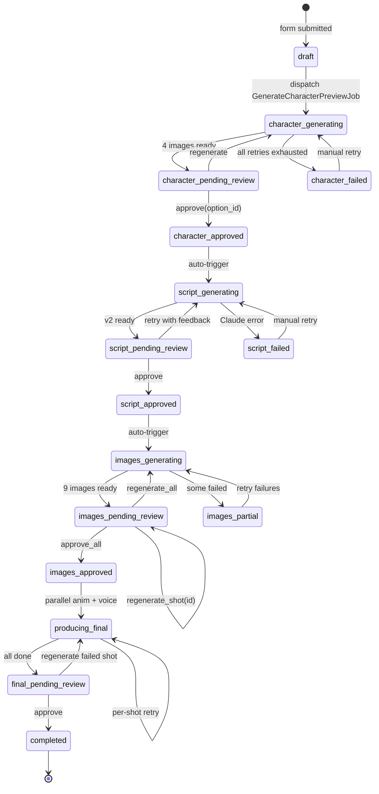
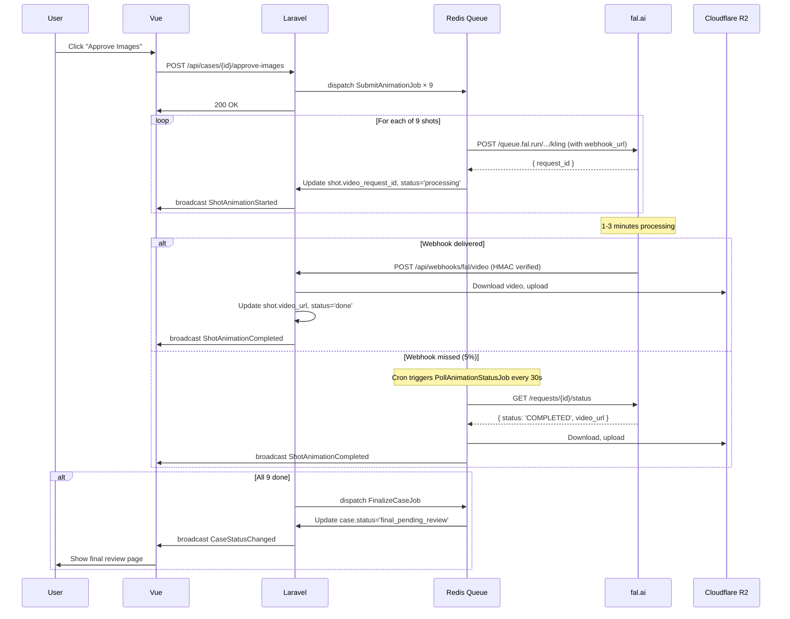

# Project Brief: Building Company AI Video Automation Tool
## (Optimized for Claude Code)

---

## 🤖 How to Read This Brief

**You are Claude Code, working in the directory `~/Desktop/aivideo/`.**

Follow this exact procedure:

1. **Read this entire file first.** Do not skim.
2. After reading, **list back to me in 5 bullets** what you understood the project to be. If anything seems contradictory, stop and ask.
3. Then **read these supporting files** (in this order):
   - `09_腳本參考/02_Reviewers.md` — exact reviewer system prompts
   - `09_腳本參考/07_松韻苑_修正版腳本_v2.md` — sample completed script (your output target)
   - `09_腳本參考/09_接案SOP_v2.0_踩坑筆記.md` — known pitfalls
4. Begin **Phase 1: Architecture Review** (see §13). Do NOT write code yet.
5. After I approve the review, proceed phase-by-phase, getting explicit approval before each phase.

**Tone**: Be direct and opinionated. Push back on anything you disagree with. I'd rather argue now than refactor later.

**Code style**: Strict types, single responsibility, no premature abstraction. Match Laravel conventions. PSR-12. Use Pest for tests.

**Cost discipline**: This project uses paid APIs. During development, ALL external API calls MUST go through stub/mock by default. Real API calls only behind `APP_USE_REAL_APIS=true` env flag, and even then only for specifically requested test scenarios.

---

## 📑 Table of Contents

1. TL;DR — 30 second summary
2. Project Context (Why This Exists)
3. Tech Stack (Required + Recommended)
4. State Machine (with Mermaid diagram)
5. External APIs (with real request/response examples)
6. Critical Pitfalls (must handle)
7. Database Schema
8. Frontend Wizard Pages
9. Job Architecture (with Kling polling sequence diagram)
10. Mock/Stub Strategy
11. Definition of Done (per phase)
12. Constraints, Preferences, Anti-Patterns
13. Phased Implementation Plan
14. Open Questions for You
15. Personal Context (operator info)
16. Success Criteria

---

## 1. TL;DR

I'm a Laravel + Vue developer building an internal-only tool to automate AI-generated marketing videos for Taiwanese building companies. The tool wraps **Anthropic Claude (script + 4 parallel reviewer agents)**, **fal.ai (Flux Pro for images, Kling 1.6 for animation)**, and **ElevenLabs (Mandarin TTS)** behind a **wizard UI with 4 human approval checkpoints**.

Per video: 9 shots × (image + animation) + 1 voiceover + 1 script + 4 reviewer audits.
Per video target cost: ≤ $5 in API spend.
Per video target operator time: ~1 hour (mostly final CapCut edit).

---

## 2. Project Context

### 2.1 What it does
For each new building project (建案), the operator runs through this wizard:

```
Stage 0: Fill form (builder data + character DNA + story outline)
Stage 1: Tool generates 4 character preview images
   ⏸ CHECKPOINT: operator picks one OR rejects all
Stage 2: Tool generates script + 4 parallel reviewer audits + revised v2
   ⏸ CHECKPOINT: operator approves OR sends feedback
Stage 3: Tool generates 9 scene images (with character LoRA)
   ⏸ CHECKPOINT: operator approves all OR regenerates specific shots
Stage 4: Tool generates 9 animations (Kling) + 1 voiceover (ElevenLabs)
   ⏸ CHECKPOINT: operator reviews assets
Stage 5: Final CapCut editing (manual, OUTSIDE this tool)
```

### 2.2 Why
Currently each video requires 6-8 hours of manual operation across Bing/Midjourney → Kling → ElevenLabs → CapCut. The bottleneck is not AI quality (proven good); it's the manual orchestration and copy-pasting between tools.

### 2.3 Scope boundaries
- ✅ Single internal operator (no client portal)
- ✅ Internal network deployment (no public exposure)
- ✅ One project at a time (concurrent cases nice-to-have, not required)
- ❌ NOT included: FFmpeg auto-edit (CapCut manual)
- ❌ NOT included: Payment, customer accounts, multi-tenant
- ❌ NOT included: Mobile app

---

## 3. Tech Stack

### 3.1 Required (non-negotiable)

| Layer | Tool | Notes |
|---|---|---|
| Backend | Laravel 11 | I'm fluent in it |
| Frontend | Vue 3 + Composition API | I prefer this over Options API |
| Build | Vite | Standard with Laravel 11 |
| Styling | Tailwind CSS | Latest |
| Database | MySQL 8 OR PostgreSQL 16 | Open to your recommendation |
| Queue | Redis + Horizon | Required for async jobs |
| Real-time | Laravel Reverb + Echo | For wizard progress updates |
| Storage | Cloudflare R2 (S3-compat) | Already provisioned |
| Auth | Sanctum (single password) | Internal use |

### 3.2 Recommended (use these unless you have strong reason)

| Concern | Package |
|---|---|
| DTO | `spatie/laravel-data` |
| Async coordination | `Bus::batch` (built-in) |
| HTTP client | `Http` facade (built-in) |
| Tests | `pestphp/pest` |
| Debugging | `laravel/telescope`, `laravel/pail` |
| State machines | inline status enum (don't pull in heavy state machine package) |

### 3.3 Anti-stack (DO NOT use)

- ❌ Inertia.js — I want a clean SPA + API split
- ❌ Filament — Overkill for a 5-page wizard
- ❌ Custom design systems — Tailwind raw + Headless UI is enough
- ❌ TypeScript on frontend — Plain JS with Vue is faster for me
- ❌ Service classes for trivial data — Use models + actions

---

## 4. State Machine

### 4.1 States and transitions



### 4.2 Rules
- Status changes broadcast `CaseStatusChanged` event
- All transitions logged to `case_status_history` table for audit
- Operator can roll back from any `*_pending_review` to a prior state
- `*_failed` states require manual operator action (no infinite auto-retry)

---

## 5. External APIs

### 5.1 Anthropic Claude API

**Models**:
- Script generation + v2 revision: `claude-sonnet-4-6`
- 4 reviewers (parallel): `claude-haiku-4-5-20251001` (cheaper, faster)

**Force JSON output via tool_use** (NOT prompt-based JSON, that breaks too often):

```php
// Example tool definition for script generation
$tools = [[
    'name' => 'submit_script',
    'description' => 'Submit the generated 60-second video script with 9 shots',
    'input_schema' => [
        'type' => 'object',
        'required' => ['concept', 'shots', 'voice_script_full', 'compliance_warnings'],
        'properties' => [
            'concept' => [
                'type' => 'object',
                'required' => ['hook', 'story_arc', 'cta'],
                'properties' => [
                    'hook' => ['type' => 'string'],
                    'story_arc' => ['type' => 'string'],
                    'cta' => ['type' => 'string'],
                ],
            ],
            'shots' => [
                'type' => 'array',
                'minItems' => 9,
                'maxItems' => 11,
                'items' => [
                    'type' => 'object',
                    'required' => ['id', 'duration_sec', 'scene', 'voiceover', 'subtitle', 'flux_prompt', 'kling_prompt'],
                    'properties' => [
                        'id' => ['type' => 'string', 'pattern' => '^S\d{2}$'],
                        'duration_sec' => ['type' => 'number'],
                        'scene' => ['type' => 'string'],
                        'camera_movement' => ['type' => 'string'],
                        'voiceover' => ['type' => 'string'],
                        'subtitle' => ['type' => 'string'],
                        'emotion' => ['type' => 'string'],
                        'flux_prompt' => ['type' => 'string', 'minLength' => 100],
                        'kling_prompt' => ['type' => 'string'],
                    ],
                ],
            ],
            'voice_script_full' => ['type' => 'string'],
            'compliance_warnings' => [
                'type' => 'array',
                'items' => ['type' => 'string'],
            ],
            'bgm_keywords' => [
                'type' => 'array',
                'items' => ['type' => 'string'],
            ],
        ],
    ],
]];

$response = Http::withHeaders([
    'x-api-key' => config('services.anthropic.key'),
    'anthropic-version' => '2023-06-01',
])->post('https://api.anthropic.com/v1/messages', [
    'model' => 'claude-sonnet-4-6',
    'max_tokens' => 8000,
    'system' => $systemPrompt,
    'tools' => $tools,
    'tool_choice' => ['type' => 'tool', 'name' => 'submit_script'],
    'messages' => [['role' => 'user', 'content' => $userInput]],
]);

// Extract structured output
$scriptData = $response->json('content.0.input');
```

**Reviewer system prompts**: see `09_腳本參考/02_Reviewers.md`. Each of the 4 reviewers gets its own focused prompt; treat that file as the canonical source.

**Rate limits**: Tier 1 ≈ 50 req/min. With 4 parallel reviewers + 1 main script + 1 v2 = 6 calls per case, well under limit.

**Approx cost per video**: $0.12 (Sonnet ~$0.05 × 2 + Haiku ~$0.005 × 4)

### 5.2 fal.ai

**Endpoints used**:
- Flux Pro 1.1: `fal-ai/flux-pro/v1.1`
- Flux LoRA (for character consistency): `fal-ai/flux-lora`
- Kling 1.6 standard: `fal-ai/kling-video/v1.6/standard/image-to-video`

**Sync vs Queue**:
- **Sync** (`POST https://fal.run/{model}`): use for character preview (4 images, ~5-10s each).
- **Queue** (`POST https://queue.fal.run/{model}`): MUST use for Kling animations (1-3 minute generation). Returns `request_id` immediately.

**Sample Flux Pro queue submission**:
```php
$response = Http::withToken(config('services.fal.key'))
    ->post('https://queue.fal.run/fal-ai/flux-pro/v1.1', [
        'prompt' => $shot->flux_prompt,
        'image_size' => 'portrait_16_9',  // ~1024x1792, close to 9:16
        'num_inference_steps' => 28,
        'guidance_scale' => 3.5,
        'num_images' => 1,
        'enable_safety_checker' => true,
        'webhook_url' => route('webhooks.fal.image', [
            'case' => $shot->case_id,
            'shot' => $shot->id,
        ]),
    ]);

// Response shape:
// {
//   "request_id": "abc-123-def",
//   "status_url": "https://queue.fal.run/.../status",
//   "response_url": "https://queue.fal.run/.../",
//   "cancel_url": "..."
// }
```

**Sample Kling submission**:
```php
$response = Http::withToken(config('services.fal.key'))
    ->post('https://queue.fal.run/fal-ai/kling-video/v1.6/standard/image-to-video', [
        'prompt' => $shot->kling_prompt,
        'image_url' => $shot->image_url,  // must be publicly accessible (use R2 signed URL)
        'duration' => '5',
        'aspect_ratio' => '9:16',
        'webhook_url' => route('webhooks.fal.video', [
            'case' => $shot->case_id,
            'shot' => $shot->id,
        ]),
    ]);
```

**Webhook callback shape**:
```json
{
  "request_id": "abc-123-def",
  "status": "OK",
  "payload": {
    "video": {
      "url": "https://fal.media/files/.../output.mp4",
      "duration": 5.04
    }
  },
  "error": null
}
```

**CRITICAL**:
- fal.media URLs only valid 24 hours → MUST download immediately to R2
- Webhook security: fal.ai signs webhooks; verify with HMAC (see §5.4)
- Free tier rate limit: ~5 concurrent requests; respect with `Bus::batch` and limited concurrency

**Approx cost per video**: $1 (9 images Flux) + $3 (9 × 5s Kling) = $4

### 5.3 ElevenLabs

**Endpoint**: `POST https://api.elevenlabs.io/v1/text-to-speech/{voice_id}`

```php
// Pre-process Mandarin numbers (CRITICAL — see Pitfall 6.8)
$text = $this->convertMandarinNumbers($text); // "11 樓" → "十一樓"

$response = Http::withHeaders([
    'xi-api-key' => config('services.elevenlabs.key'),
    'Accept' => 'audio/mpeg',
])->post("https://api.elevenlabs.io/v1/text-to-speech/{$voiceId}", [
    'text' => $text,
    'model_id' => 'eleven_multilingual_v2',
    'voice_settings' => [
        'stability' => 0.45,
        'similarity_boost' => 0.80,
        'style' => 0.15,
        'use_speaker_boost' => true,
    ],
]);

// Response: binary mp3 audio
$mp3Binary = $response->body();
```

**Voice selection**: Operator picks from `config/elevenlabs.php` array of pre-tested Mandarin voice IDs. Don't auto-pick.

**Approx cost per video**: $0.04 (200 chars × $0.18 / 1K chars)

### 5.4 Webhook security (HMAC)

Both fal.ai webhooks need verification:

```php
// app/Http/Middleware/VerifyFalWebhook.php
public function handle(Request $request, Closure $next)
{
    $signature = $request->header('X-Fal-Signature');
    $expected = hash_hmac('sha256', $request->getContent(), config('services.fal.webhook_secret'));

    if (!hash_equals($expected, $signature)) {
        abort(401, 'Invalid webhook signature');
    }

    return $next($request);
}
```

---

## 6. Critical Pitfalls (Discovered Through Manual Testing)

These are real failures I hit during 10+ hours of manual testing. Architecture must handle them.

### 6.1 Character consistency drift
**Problem**: Same prompt produces different cat eye colors (amber → blue → heterochromia between generations).
**Solution**:
1. After operator approves character, train a **Flux LoRA** from that approved image (one-time $2-3)
2. Subsequent shots use `fal-ai/flux-lora` with the trained LoRA URL
3. Character DNA (text prompt) stays in every prompt as reinforcement
4. Set `lora_scale: 0.8` in subsequent generations

**Alternative**: If LoRA training fails, fall back to `fal-ai/flux-pro/v1.1-ultra/redux` with the approved image as reference. Slightly worse consistency but no training step.

### 6.2 Aspect ratio
- DO NOT include `--ar 9:16` or similar in prompts (Midjourney syntax, ignored by Flux/DALL-E)
- USE `image_size: 'portrait_16_9'` parameter
- Reinforce in prompt text: `tall vertical portrait composition, full body framed top to bottom`

### 6.3 Pixar style vs photorealistic collision
When prompts include "Asian couple", Flux defaults to photorealistic and ignores Pixar instructions.
**Mitigation**: Triple-enforcement at top of prompt:
```
A 3D Pixar animated movie scene, fully cartoon stylized animation, NOT photorealistic.
[main subject description]
[other subjects "rendered in Pixar 3D animation style"]
```

### 6.4 Element omission
Strong primary subject (cute cat) causes secondary elements (humans) to be dropped.
**Mitigation**: Reorder prompt — put the element you most want preserved as the FIRST described subject.

### 6.5 Chinese text rendering
DALL-E 3 / Flux fail to render Chinese text correctly (always garbled).
**Mitigation**: NEVER ask AI to render text. Generate "blank surface, text will be added in post-production". CapCut step adds text manually.

### 6.6 Kling timing variance
- Normal: 1-3 min per 5s clip
- Sometimes hangs at 30+ minutes
- Sometimes fails with vague error
**Mitigation**:
- Use webhook callback as primary
- Cron polling every 30s as fallback (in case webhook missed)
- After 5 min no completion → resubmit (max 3 retries)
- After 3 retries → mark failed, surface to UI as "regenerate this shot"

### 6.7 Taiwan advertising compliance (公平交易法 §21)
Cannot use these words: 最佳/最好/全台/保證/絕對/百分百
Distance claims need real measurement (e.g. "3 minutes walking" requires actual <240m)
Future scenes need "示意圖" disclaimer
**Mitigation**: Reviewer 3 (Compliance) flags violations. Script generator's system prompt also blocks these words upfront.

### 6.8 Number/character mixing in Mandarin TTS
ElevenLabs reads "11 樓" as "eleven 樓".
**Mitigation**: Pre-process voiceover text:
```php
// Naive but effective for our use case
$text = preg_replace_callback('/(\d+)/', function ($match) {
    return $this->numberToChinese($match[1]); // "11" → "十一"
}, $text);
```

---

## 7. Database Schema

```sql
-- Main case entity
CREATE TABLE building_cases (
    id CHAR(36) PRIMARY KEY,  -- UUID
    
    -- Form data
    name VARCHAR(255) NOT NULL,
    builder_name VARCHAR(255),
    location VARCHAR(255),
    area_range VARCHAR(64),
    price_range VARCHAR(64),
    target_audience ENUM('first_buyer', 'upgrade', 'retiree', 'investor'),
    tone ENUM('warm_family', 'premium', 'energetic', 'luxury'),
    video_length_seconds SMALLINT NOT NULL,
    platforms JSON,
    
    -- Character
    character_dna TEXT NOT NULL,
    character_nickname VARCHAR(64),
    approved_character_id CHAR(36) NULL,  -- FK character_options
    character_lora_url VARCHAR(512) NULL,  -- trained LoRA endpoint URL
    
    -- Story
    story_outline TEXT,
    must_have TEXT,
    taboos TEXT,
    
    -- Status
    status VARCHAR(64) NOT NULL DEFAULT 'draft',
    status_message TEXT NULL,
    
    -- AI outputs
    script_v1 JSON NULL,
    script_v2 JSON NULL,
    reviews JSON NULL,
    voiceover_id CHAR(36) NULL,
    
    -- Cost tracking
    cost_usd DECIMAL(10, 4) NOT NULL DEFAULT 0,
    
    -- Delivery
    drive_folder_url VARCHAR(512) NULL,
    
    -- Timestamps
    created_at TIMESTAMP DEFAULT CURRENT_TIMESTAMP,
    updated_at TIMESTAMP DEFAULT CURRENT_TIMESTAMP ON UPDATE CURRENT_TIMESTAMP,
    completed_at TIMESTAMP NULL,
    
    INDEX idx_status (status),
    INDEX idx_created (created_at)
);

-- 4 character preview options
CREATE TABLE character_options (
    id CHAR(36) PRIMARY KEY,
    case_id CHAR(36) NOT NULL,
    prompt TEXT NOT NULL,
    image_url VARCHAR(512) NULL,
    fal_request_id VARCHAR(128) NULL,
    status ENUM('pending', 'done', 'failed') NOT NULL DEFAULT 'pending',
    cost_usd DECIMAL(10, 4) NOT NULL DEFAULT 0,
    error_message TEXT NULL,
    created_at TIMESTAMP DEFAULT CURRENT_TIMESTAMP,
    
    FOREIGN KEY (case_id) REFERENCES building_cases(id) ON DELETE CASCADE,
    INDEX idx_case (case_id, status)
);

-- 9 shots per case
CREATE TABLE shots (
    id CHAR(36) PRIMARY KEY,
    case_id CHAR(36) NOT NULL,
    shot_id VARCHAR(8) NOT NULL,  -- "S01"
    shot_order TINYINT NOT NULL,
    
    duration_seconds DECIMAL(4, 1),
    scene_description TEXT,
    camera_movement VARCHAR(255),
    voiceover_text TEXT,
    subtitle TEXT,
    emotion VARCHAR(64),
    
    flux_prompt TEXT NOT NULL,
    kling_prompt TEXT,
    
    image_url VARCHAR(512) NULL,
    image_request_id VARCHAR(128) NULL,
    image_status ENUM('pending', 'processing', 'done', 'failed') NOT NULL DEFAULT 'pending',
    image_retry_count TINYINT NOT NULL DEFAULT 0,
    image_cost_usd DECIMAL(10, 4) NOT NULL DEFAULT 0,
    
    video_url VARCHAR(512) NULL,
    video_request_id VARCHAR(128) NULL,
    video_status ENUM('pending', 'processing', 'done', 'failed') NOT NULL DEFAULT 'pending',
    video_retry_count TINYINT NOT NULL DEFAULT 0,
    video_cost_usd DECIMAL(10, 4) NOT NULL DEFAULT 0,
    video_error TEXT NULL,
    
    is_approved BOOLEAN NOT NULL DEFAULT FALSE,
    
    created_at TIMESTAMP DEFAULT CURRENT_TIMESTAMP,
    updated_at TIMESTAMP DEFAULT CURRENT_TIMESTAMP ON UPDATE CURRENT_TIMESTAMP,
    
    FOREIGN KEY (case_id) REFERENCES building_cases(id) ON DELETE CASCADE,
    UNIQUE KEY uk_case_shot (case_id, shot_id),
    INDEX idx_video_status (video_status, video_request_id)
);

-- Voiceovers
CREATE TABLE voiceovers (
    id CHAR(36) PRIMARY KEY,
    case_id CHAR(36) NOT NULL,
    text TEXT NOT NULL,
    voice_id VARCHAR(128) NOT NULL,
    audio_url VARCHAR(512) NULL,
    duration_seconds DECIMAL(4, 1) NULL,
    cost_usd DECIMAL(10, 4) NOT NULL DEFAULT 0,
    status ENUM('pending', 'done', 'failed') NOT NULL DEFAULT 'pending',
    created_at TIMESTAMP DEFAULT CURRENT_TIMESTAMP,
    
    FOREIGN KEY (case_id) REFERENCES building_cases(id) ON DELETE CASCADE
);

-- Audit trail of state changes
CREATE TABLE case_status_history (
    id BIGINT AUTO_INCREMENT PRIMARY KEY,
    case_id CHAR(36) NOT NULL,
    from_status VARCHAR(64),
    to_status VARCHAR(64) NOT NULL,
    triggered_by ENUM('system', 'operator') NOT NULL,
    note TEXT,
    created_at TIMESTAMP DEFAULT CURRENT_TIMESTAMP,
    
    FOREIGN KEY (case_id) REFERENCES building_cases(id) ON DELETE CASCADE,
    INDEX idx_case (case_id, created_at)
);
```

---

## 8. Frontend Wizard Pages

### 8.1 Page-by-page spec

| Route | Purpose | Key components | Approval action |
|---|---|---|---|
| `/cases/new` | Create new case | Form: builder data, character DNA (paste from Cowork artifact), story outline, must-haves, taboos | Submit → POST → redirect to /character |
| `/cases/{id}/character` | Pick character | 4 image cards (real-time fill as Flux returns), per-card Approve button, "Regenerate all" button | Approve(option_id) |
| `/cases/{id}/script` | Review script | v2 script in readable format, 4 reviewer panels (red/yellow flags), feedback textarea | Approve OR Retry(feedback) |
| `/cases/{id}/images` | Approve scene images | 3×3 grid of S01-S09, per-card Regenerate, "Approve all" sticky bottom bar | Approve all |
| `/cases/{id}/final` | Final review | Asset list (images, videos, voiceover), inline previews, Drive folder link | Mark complete |

### 8.2 Real-time strategy

```js
// Pinia store
import Echo from 'laravel-echo';

const useCaseStore = defineStore('case', {
    state: () => ({ case: null, shots: [] }),
    actions: {
        async load(caseId) {
            this.case = await axios.get(`/api/cases/${caseId}`).then(r => r.data);
            this.subscribe(caseId);
        },
        subscribe(caseId) {
            Echo.private(`case.${caseId}`)
                .listen('CaseStatusChanged', (e) => { this.case.status = e.status; })
                .listen('CharacterOptionGenerated', (e) => { /* update option */ })
                .listen('ShotImageGenerated', (e) => { /* update shot */ })
                .listen('ShotAnimationCompleted', (e) => { /* update shot */ });
        },
    },
});
```

---

## 9. Job Architecture

### 9.1 Job inventory

| Job | Trigger | Concurrency | Retries |
|---|---|---|---|
| `GenerateCharacterPreviewJob` | Form submit | 4 parallel (Bus::batch) | 2 |
| `GenerateScriptJob` | Character approved | Single | 2 |
| `RunReviewerJob` | After v1 script | 4 parallel (Bus::batch) | 2 |
| `GenerateScriptV2Job` | After 4 reviews | Single | 2 |
| `GenerateImagesBatchJob` | Script approved | Dispatcher | — |
| `GenerateSingleImageJob` | Per shot | 3 parallel max | 3 |
| `RegenerateSingleImageJob` | Operator request | 1 | 3 |
| `SubmitAnimationJob` | Images approved | 3 parallel max | 1 (then retry via PollAnimationStatusJob) |
| `PollAnimationStatusJob` | After submit, also cron | Single per request | 60 (over 30 min) |
| `GenerateVoiceJob` | Images approved (parallel with anim) | Single | 2 |
| `FinalizeCaseJob` | All animations + voice done | Single | 1 |

### 9.2 Kling polling sequence diagram



### 9.3 Idempotency
Every job must be safely retry-able. Patterns:
- Check existing state before API call (e.g. `if shot.video_url is set, skip`)
- Use `request_id` as dedup key for fal.ai
- Use database transactions for state updates

---

## 10. Mock/Stub Strategy

**During development, every external API call must support stubbing without code changes**.

### 10.1 Implementation pattern

```php
// app/Services/Contracts/FalAiServiceContract.php
interface FalAiServiceContract {
    public function submitFluxImage(string $prompt): FalImageResponse;
    public function submitKlingVideo(string $imageUrl, string $prompt): FalVideoSubmission;
    // ...
}

// app/Services/FalAiService.php  (real)
final class FalAiService implements FalAiServiceContract { /* ... */ }

// app/Services/StubFalAiService.php
final class StubFalAiService implements FalAiServiceContract {
    public function submitFluxImage(string $prompt): FalImageResponse {
        // Return canned response with sample image from storage/fixtures/
        return FalImageResponse::from([
            'request_id' => 'stub_' . uniqid(),
            'image_url' => Storage::disk('local')->url('fixtures/sample_character_1.png'),
        ]);
    }
}

// app/Providers/AppServiceProvider.php
public function register(): void {
    $this->app->bind(FalAiServiceContract::class, function () {
        return config('services.fal.use_real')
            ? new FalAiService()
            : new StubFalAiService();
    });
}
```

### 10.2 Fixture files
Provide sample assets in `storage/fixtures/`:
- `sample_character_1.png` ... `sample_character_4.png` (4 character options)
- `sample_shot_S01.png` ... `sample_shot_S09.png` (9 scene images)
- `sample_video_S01.mp4` ... `sample_video_S09.mp4` (9 short clips)
- `sample_voiceover.mp3` (1 voice file)
- `sample_script.json` (matches the script schema)
- `sample_reviews.json` (matches reviewer output)

### 10.3 Env flag
```env
APP_USE_REAL_APIS=false  # default: stubs
APP_USE_REAL_APIS=true   # only when explicitly testing live integration
```

When `APP_USE_REAL_APIS=true`, also set `APP_API_BUDGET_USD=10` to hard-cap spending per run.

---

## 11. Definition of Done (per phase)

Each phase has explicit DoD. Don't leave a phase early.

### Phase 1: Architecture Review
- [ ] You've identified 3+ risks/gaps in this brief
- [ ] You've made 1+ architectural recommendation I haven't proposed
- [ ] You've answered the open questions in §14
- [ ] We've agreed on iteration order

### Phase 2: Project Setup
- [ ] `composer.json` and `package.json` finalized
- [ ] `.env.example` includes all keys with comments
- [ ] All migrations run cleanly on fresh DB
- [ ] All model classes exist with correct relationships
- [ ] All service interfaces + stub implementations exist
- [ ] One end-to-end smoke test: form → stubbed character → stubbed script → done

### Phase 3: Real API Integration
- [ ] ClaudeService produces valid script JSON via tool_use (verified against schema)
- [ ] FalAiService submits Flux + Kling, handles webhooks
- [ ] ElevenLabsService produces audio, with Mandarin number preprocessing
- [ ] All services have Pest tests with mocked HTTP
- [ ] Cost tracking functional (cases.cost_usd updates correctly)

### Phase 4: Job Implementation
- [ ] All 11 jobs exist with retries + idempotency
- [ ] Bus::batch chains work for parallel reviewers + character preview
- [ ] Kling polling: webhook primary + cron fallback both work
- [ ] Failure paths tested (e.g. fal.ai 500, Claude rate limit)

### Phase 5: Frontend
- [ ] 5 wizard pages render and call APIs
- [ ] Reverb broadcasts received and update Pinia store
- [ ] Single-shot regeneration works on /images page
- [ ] Form validation matches backend Form Request

### Phase 6: Polish
- [ ] Horizon dashboard shows queue health
- [ ] Telescope captures requests + jobs
- [ ] Pest test coverage on services + jobs ≥ 80%
- [ ] README documents env setup + deployment

---

## 12. Constraints, Preferences, Anti-Patterns

### 12.1 What I want
- **Iteration over perfection**: end-to-end stub pipeline first, then add real APIs
- **Type-safe DTOs**: spatie/laravel-data for every API response
- **Idempotent jobs**: safe to retry
- **Observable**: structured logs, Telescope, Horizon
- **Stub by default**: real API calls only when explicitly testing

### 12.2 What I don't want
- **Over-abstracted**: no Repository pattern unless justified, no interface for everything
- **Microservices**: monolith only
- **Heavy state machine packages**: inline status enum is fine
- **Custom design systems**: Tailwind + Headless UI components
- **Tests for trivial things**: skip controllers/views, focus on services/jobs/integration

### 12.3 Anti-patterns to flag if you see them
- "Maybe we should add caching here" without measurable need
- "Let's make this configurable" without 2+ use cases
- "This should be its own package" before the monolith works
- "We need a service for X" when an Action class would do
- "What about scaling?" when scale isn't a near-term concern

### 12.4 Code conventions
- Single-line PHP method signatures unless params >5
- `final class` by default unless inheritance is intended
- Strict types: `declare(strict_types=1);` at top of every PHP file
- Vue: Composition API with `<script setup>`, props/emits typed via JSDoc
- Tailwind: no custom CSS unless absolutely necessary
- File naming: kebab-case for routes/views, PascalCase for classes

---

## 13. Phased Implementation Plan

### Phase 1: Architecture Review (1-2 hours of conversation)
You read this brief, supporting docs, and respond with:
1. List 3+ risks/gaps you found
2. 1+ architectural recommendation
3. Answers to §14 open questions
4. Proposed iteration order (your version, may differ from below)
5. Estimated total effort

**STOP after Phase 1. Wait for my approval before Phase 2.**

### Phase 2: Project Setup (4-6 hours)
- composer + npm dependencies
- migrations + models + relationships
- service interfaces + stubs
- .env.example, README scaffolding
- One smoke test

### Phase 3: Real API Integration (8-10 hours)
- ClaudeService with tool_use
- FalAiService (sync + queue + webhook)
- ElevenLabsService
- R2StorageService
- Pest tests for all 3

### Phase 4: Job Implementation (10-12 hours)
- All 11 jobs
- Polling pattern for Kling
- Idempotency
- Failure handling + retries

### Phase 5: Frontend (12-15 hours)
- 5 wizard pages
- Pinia store + Echo subscriptions
- API client with axios
- Form validation

### Phase 6: Polish + Deploy (4-6 hours)
- Horizon + Telescope
- Logs + monitoring
- Forge deploy + Reverb config

**Total: ~40-50 hours over 3-4 weeks (part-time)**

---

## 14. Open Questions for You

Please answer these in Phase 1:

1. **LoRA training**: Mandatory per case (extra $3 + ~5 min) or optional? Recommendation?
2. **Inertia vs SPA**: I lean SPA. Disagree? Why?
3. **Case concurrency**: Should the system support multiple in-flight cases or is single-tenant fine?
4. **Failed case recovery**: If server restarts mid-Kling-poll, how should we resume? (DB lookup pending requests on boot?)
5. **fal.ai URL TTL**: Download immediately on completion (more storage cost) or just-in-time when operator views (more API risk)?
6. **Database choice**: MySQL 8 or PostgreSQL 16 — your recommendation given JSON column usage?
7. **Reverb hosting**: Same Forge instance as app, or dedicated? At what scale does it need separation?
8. **Test isolation**: Should Pest mock at HTTP level (Http::fake) or service level (interface stub)?
9. **Cost cap**: Should I enforce per-case budget cap (e.g. abort if cost > $10)?
10. **Operator authentication**: Single shared password OK, or proper user accounts even for solo use?

---

## 15. Personal Context (Operator)

> 💡 **Fill this in before pasting to Claude Code so it can calibrate explanations**

- Laravel experience: [years / level / favorite features]
- Vue experience: [years / Composition vs Options API preference]
- Used before: [Horizon? Reverb? Sanctum? Telescope? Sail?]
- Database preference: [MySQL / PostgreSQL / either]
- Deploy target: [Forge / VPS / local first]
- IDE: [PHPStorm / VSCode / Cursor]
- Available time: [hours per day / total weeks]
- Existing related work: [any Laravel projects with queues/APIs already?]
- Budget for API testing: [USD]

---

## 16. Success Criteria

When this tool is complete, it should:
- ✅ Reduce per-video operator time from 6-8h → ~1h (CapCut only)
- ✅ Cost ≤ $5 in API per video
- ✅ Handle Kling failures gracefully (retry + UI surface)
- ✅ Maintain character consistency at 90%+ across shots (via LoRA)
- ✅ Auto-flag Taiwan advertising compliance issues
- ✅ Allow regenerating any single shot without redoing the case
- ✅ Run on internal network (no public exposure)
- ✅ Survive server restarts mid-processing (resume state)

---

## Final Instructions

**Begin with Phase 1: Architecture Review.**

Read this entire brief, then `09_腳本參考/02_Reviewers.md`, `09_腳本參考/07_松韻苑_修正版腳本_v2.md`, and `09_腳本參考/09_接案SOP_v2.0_踩坑筆記.md`.

Then come back with:
1. 5-bullet summary of what you understood
2. 3+ risks/gaps you identified
3. 1+ architectural recommendation
4. Answers to §14 open questions
5. Your proposed iteration order
6. Estimated total effort

**Do not write any code yet.** Wait for my approval before Phase 2.

If anything in this brief contradicts itself or doesn't make sense, stop and ask before proceeding. I'd rather catch issues now than 30 hours into implementation.
