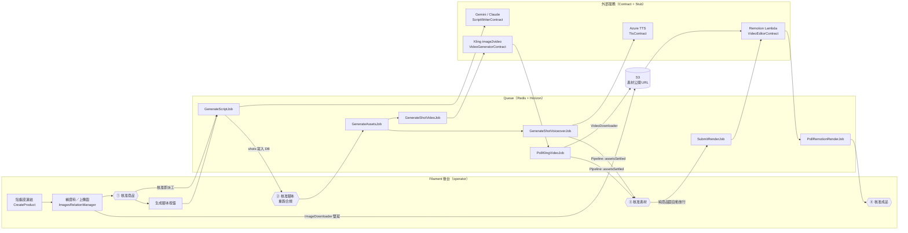
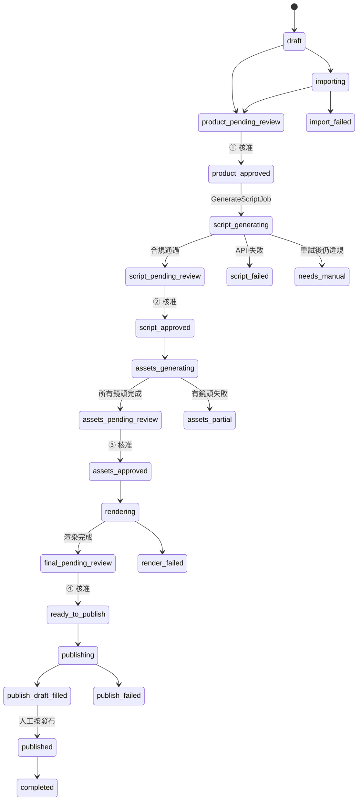

# ARCHITECTURE

蝦皮分潤短影音自動化：貼一條蝦皮商品連結 → 補齊商品資料與圖片 → LLM 寫分鏡腳本（含合規自動重試）→ 素材（B-roll 動畫／配音）→ Remotion Lambda 渲染 1080×1920 直式影片 → 上架。
全程以 `Product` 的狀態機驅動，中間有 **4 個人工 checkpoint**。

> 本文件依 `app/` 與 `remotion/` 的實際程式碼撰寫。根目錄 `CLAUDE.md` 的「建案影片／BuildingCase／fal.ai」描述屬於舊專案，已不符現況。

---

## 1. 全景



每個階段結束後由 `App\Services\Pipeline` 決定下一棒，以及該 checkpoint 能不能自動放行（見 §4「接力與自動放行」）。

---

## 2. 核心資料模型

| Model | 角色 | 重點欄位 |
|---|---|---|
| `Product` | 一支影片的聚合根 | `status`（`ProductStatus`）、商品資料、`script`（LLM 原始輸出 JSON）、`caption`/`hashtags`、`compliance_*`、`audio_mode`、`video_provider`、`script_provider`、`video_length_seconds`、`subtitle_settings`、`global_transition`、`default_ken_burns`、`bgm_remote_url`、`render_id`、`final_video_url`、`cost_usd` / `llm_cost_usd` |
| `ProductImage` | 商品圖 | `local_path`、`remote_url`（S3）、`is_selected`、`is_primary`、`license_status`、寬高 → `suggestedFit()`（高寬比 ≥1.5 用 `cover`，否則 `contain`） |
| `Shot` | 分鏡（`S01`…） | `shot_order`、`role`、`duration_seconds`、`subtitle`、`voiceover_text`/`voiceover_status`/`voiceover_remote_url`、`ken_burns`、`transition`、`fit`、`image_remote_url`、`video_status`/`video_remote_url`、`compliance_flags` |
| `Voiceover` | 配音紀錄（`shot_uuid` → Shot） | `duration_seconds`、`cost_usd` |
| `ProductStatusHistory` | 每次狀態轉移的稽核紀錄 | `from_status`、`to_status`、`triggered_by`（`operator` / `llm` / `system`）、`note` |
| `BrowserTask` | Playwright 類任務（morph 到 subject） | `type`（抓商品／短連結／發布草稿／Dola…）、`status`、`strategy_used`；目前 `app/` 內尚無執行者 |

成本分兩欄互斥記帳：`cost_usd`（動畫／配音／剪接）與 `llm_cost_usd`（寫稿），`totalCostUsd()` 加總。

---

## 3. 狀態機（`app/Enums/ProductStatus.php`）

所有轉移都走 `Product::transitionTo()`，依 `ProductStatus::TRANSITIONS` 白名單驗證，不合法丟 `IllegalStatusTransition`，並寫一筆 `ProductStatusHistory`。`forceStatus()` 只給管理操作（例如解除封存）繞過驗證。



（每個狀態都可轉 `archived`；多數 checkpoint 可退回上一階段，完整表見程式碼。）

- `isCheckpoint()`：`product_pending_review`、`script_pending_review`、`assets_pending_review`、`final_pending_review`
- `isProcessing()`：`importing`、`script_generating`、`assets_generating`、`rendering`、`publishing`（UI 應鎖定操作）

---

## 4. Pipeline 逐階段

### P1 建立商品 — `CreateProduct`

1. operator 貼連結 → `ShopeeLinkParser::parse()`
   - 網域白名單（`shopee.tw` 及子網域、`s.shopee.tw` / `shope.ee` / `shp.ee`），不用 `str_contains` 以免 `evil-shopee.com` 被放行。
   - 短連結用 HTTP 301 追蹤還原（`X-Guzzle-Redirect-History` 取最後一跳）；落到 `error_page` 視為無效（該頁回 200）。
   - 從 `-i.{shopId}.{itemId}` 或 `/product/{shopId}/{itemId}` 取 id（**shopId 在前**）。
2. 依 `(shopee_shop_id, shopee_item_id)` 去重，已存在就導去既有紀錄。
3. 建立 `draft` 骨架，帶入 `subtitle_settings` 與 `disclosure_prefix` 預設值。

自動抓商品資料（`importing` 狀態、`BrowserTaskType::ShopeeScrapeProduct`）規劃在 P5 Playwright，目前由 operator 手動補齊。

### P2 圖片入庫 — `ImagesRelationManager` + `ImageDownloader`

三種入口：Filament 上傳（`adoptPublicFile()`）、外部網址（`download()`）、蝦皮 CDN（`ImageDownloader::shopee()`，自動帶 Referer、去掉 `@resize_w…` 拿原圖）。

**本地 public disk + S3 雙寫**是硬性規則：Remotion Lambda 只讀得到公開 URL，`remote_url` 為 null 的圖到 Lambda 一定 404。S3 失敗不吞例外（`filesystems.s3.throw = true`）。BGM 上傳也走同一條路徑（`ProductResource::adoptBgmUpload()`）。

每張圖有 `license_status` 留痕（蝦皮聯盟條款 5.4(f) 禁止未經同意抓取賣家素材）。

### Checkpoint ① 商品資料 — `EditProduct::approveProductAction`

`ProductResource::approvalBlockers()`：勾選圖片 ≥ 2 張、全部已同步 S3、`title` / `affiliate_url` / `disclosure_prefix` 皆有值。

### P3 LLM 寫稿 — `GenerateScriptJob`

由「生成腳本」按鈕派工（按鈕只派工，狀態轉移交給 Job）。入口狀態限 `product_approved` / `script_failed` / `needs_manual`。

```
transitionTo(script_generating)
for attempt in 0..MAX_RETRIES(=1):
    writer = resolveWriter(product)           # products.script_provider 覆寫，否則容器綁定
    output = writer.write(product, options)   # 例外 → status_message + script_failed，結束
    addLlmCost(lastUsage.cost_usd)            # 每次呼叫都記帳，失敗也算錢
    fields = ScriptFields::fromOutput(...)    # 攤平成 欄位路徑 => 文字
    檢查：AdComplianceChecker blocking / 簡體字 / 字幕 > 22 字 / profileBlocked
    全過 → persist + writeShots → script_pending_review，結束
    profileBlocked 或已達上限 → break
    options = retry_report + retry_feedback   # 把違規清單餵回 LLM 重寫
persist + writeShots（照樣寫進 DB 讓 operator 看得到）→ needs_manual_reason → needs_manual
```

關鍵元件：

| 元件 | 職責 |
|---|---|
| `ScriptWriterFactory` | 解析 provider。`use_real_apis=false` 時**無論指定什麼都回 `StubScriptWriter`**（防護網）。預設 Gemini（免費 tier），Claude 為付費品質備案。 |
| `GeminiScriptWriter` | 直接打 REST、key 放 header；model chain 遇 503/429/逾時（`RetryableModelError`）自動換備援 model。 |
| `ClaudeScriptWriter` | Anthropic SDK structured output（`outputConfig.format = ScriptOutput::class`），依實際 token 與 cache read/write 單價算成本。 |
| `ScriptPromptBuilder` | system 固定三個 block（角色風格／繁中規範／該 profile 法規紅線），cache 斷點在最後；商品資料只進 user prompt，以維持 prompt cache 命中。重試時附違規清單。 |
| `ScriptSchema` | provider 無關的 schema 單一來源（roles、ken burns、6 種轉場、4–8 鏡、字幕 22 字、caption 180 字）。`toGeminiSchema()` 給 Gemini，`ScriptOutput`/`ScriptShot` 的 attribute 給 Claude；`hydrate()` 寬鬆修補 LLM 回傳。 |
| `ScriptDurationPlanner` + `ShotDurationEstimator` | 每鏡秒數 = max(LLM 給的, 字幕可讀時間 4.5 字/秒 + 0.8s)；總長偏離目標 >15% 才等比縮放；夾在 1.5–6.0 秒、0.5 秒為單位。有效總長扣除非 cut 轉場的 0.5s overlap。 |
| `writeShots()` | 先刪舊 shots 再重建 `S01…`；`imageRef` 超出範圍取模；`audio_mode = none` 時不寫配音稿；`fit` 由圖片長寬比推導。 |

字幕字數必須在 Job 自己用 `mb_strlen` 擋：Anthropic SDK 的 `maxLength` 用 `strlen`（位元組），Gemini schema 不支援 `maxLength`。

### 合規 — `AdComplianceChecker` + `TraditionalChineseValidator`

- 規則與法條全在 `config/compliance.php`；checker 只負責 profile 繼承（如 `supplement → food → general`）、白名單遮罩、soft words 升級、`only_when` 條件、揭露前綴檢查。
- `profileForCategory()` 依分類推 profile；`restricted` 優先，命中即 `profileBlocked`（整類不給做，重寫也沒用）。
- finding 分 `blocking`（法規紅線，不可略過）與 `warning`（需 operator 逐條 acknowledge）。offset/length 一律為 mb 字元位置。
- `rulesFingerprint()` = 規則內容 sha1 前 12 碼；`Product::renderBlockers()` 比對 fingerprint，規則改過就必須重掃。
- `TraditionalChineseValidator`：簡體字、大陸用語、網路流行語、非台灣字形（Noto TC 可能缺字 → 渲染成 □）。設計前提是「誤判比漏判更擾人」。
- `ScriptFields` 是 LLM 輸出與 DB 現況共用的攤平邏輯；caption 會接上揭露前綴再掃。

### Checkpoint ② 腳本 — `EditProduct::approveScriptAction`

operator 可直接在 `ShotsRelationManager` 改字幕、配音稿、運鏡、轉場、換圖，所以核准時**重跑**合規（`ProductResource::checkScript()` → `mergeAcknowledged()` 保留已確認的 warning），寫回報告並更新每鏡 `compliance_flags`，再以 `scriptApprovalBlockers()` 把關：有鏡頭、無 profileBlocked、無 blocking、warning 全確認、無簡體字、有揭露前綴。

### 接力與自動放行 — `App\Services\Pipeline`

| 時機 | 下一棒 | 自動放行條件（`config('video.autopilot.*')`） |
|---|---|---|
| ① 送審 | `afterProductSubmitted` → 核准並派 `GenerateScriptJob` | `product`（預設開）且 `approvalBlockers()` 為空 |
| ① 人工核准 | `afterProductApproved` → 派 `GenerateScriptJob` | — |
| 寫稿完成 | `afterScriptGenerated` → 核准 ② 並派素材 | `script`（**預設關**）且零 finding、`scriptApprovalBlockers()` 為空 |
| ② 核准 | `afterScriptApproved` → 派 `GenerateAssetsJob` | — |
| 素材全部結束 | `assetsSettled` → `assets_partial` 或 `assets_pending_review` | — |
| 素材待審 | `afterAssetsReady` → 核准 ③ 並派 `SubmitRenderJob` | `assets`（預設開）且 `video_provider = none`（有 AI 動畫一定停下來看） |
| ③ 核准 | `afterAssetsApproved` → 派 `SubmitRenderJob` | — |

自動放行的狀態轉移以 `triggered_by = autopilot` 寫進 `product_status_history`。`assetsSettled()` 用 row lock，避免兩個 worker 同時完成最後兩鏡而重複推進狀態。

### P5/P6 素材派工 — `GenerateAssetsJob`

入口狀態為 `script_approved` 或 `assets_partial`（重試）。先把**所有**要做的鏡頭標成 `pending`，再逐鏡派工，否則第一個完成的任務會誤判「全部完成」。已 `done` 的鏡頭不重做，部分失敗重試只補失敗的。

- `audio_mode = tts` 且有配音稿 → `GenerateShotVoiceoverJob`
- `video_provider = kling` → `GenerateShotVideoJob`
- 兩者皆無（純商品圖、無配音）→ 直接 `assetsSettled()`

配音狀態只在 TTS 模式才計入完成判斷：`GenerateScriptJob` 在 `bgm_only` 也會寫配音稿並標 `pending`。

### P5 素材：B-roll 動畫 — `GenerateShotVideoJob` + `KlingVideoGenerator` + `PollKlingVideoJob`

- `GenerateShotVideoJob`：用 `image_remote_url`（S3）送 Kling，prompt 取 `shots.video_prompt`，沒填就用「商品本體不可變形」的預設 prompt；送出失敗直接標 `failed`。
- `submitImageToVideo()`：Kling V2.5 Turbo（JWT HS256 認證），秒數只能 5 或 10（`normalizeDuration`），本地圖轉 base64。
- `PollKlingVideoJob`：每 10 秒輪詢、上限 30 次。成功 → `VideoDownloader` 下載並雙寫 S3（Kling URL 會過期，渲染一律用自家 S3 副本）→ `video_status=done`、記成本。
- 成功或失敗都呼叫 `Pipeline::assetsSettled()`，由它判斷是否全部結束。
- `video_provider = none` 時不產動畫，鏡頭直接用商品圖 + Ken Burns。`dola` 為規劃中的 provider（`BrowserTaskType::DolaGenerateVideo`）。

### P6 素材：配音 — `GenerateShotVoiceoverJob` + `AzureTts`

`GenerateShotVoiceoverJob` 用 `products.voice_id_preferred`（預設曉臻）合成，沒有 S3 `remote_url` 視為失敗（Lambda 讀不到本地檔）。成功後寫 `voiceover_*` 欄位、一筆 `Voiceover`，並以 `ShotDurationEstimator::fromTts()` 重算該鏡 `duration_seconds`（padding 0.6s > overlap 0.5s，避免相鄰配音疊音）。

`AzureTts::synthesize()`：先 `MandarinNumber::toChinese()` 把數字轉中文讀法 → SSML → MP3，本地 + S3 雙寫，時長用字數 × 0.35 秒估算。預設聲音 `zh-TW-HsiaoChenNeural`（可選聲音見 `ProductResource::VOICES`）。

### Checkpoint ③ → P7 渲染 — `RemotionVideoEditor` + `PollRemotionRenderJob`

`SubmitRenderJob`（入口 `assets_approved` / `render_failed`）送出前必須 `Product::renderBlockers()` 為空：可渲染鏡頭 ≥ 2、無簡體字、無大陸字形、`compliance_passed`、fingerprint 為最新、有揭露前綴、TTS 模式下配音全完成、沒有進行中的 `render_id`。（渲染廢片要花錢，寧可送出前擋。）不為空時照樣走 `rendering → render_failed`，把原因寫進 `status_message`，自動放行觸發時才看得到。

`submitRender()` 呼叫 `renderMediaOnLambda`（composition `ProductVideo`、h264、`frames_per_lambda` 預設 150），把 `{renderId, bucketName}` JSON 存進 `products.render_id`。
`PollRemotionRenderJob` 每 15 秒輪詢、上限 20 次（約 5 分鐘）：完成 → 寫 `final_video_url`、清 `render_id` → `final_pending_review`；失敗／逾時 → `status_message` + `render_failed`。

### Checkpoint ④ → 上架

`ready_to_publish → publishing → publish_draft_filled → published`：規劃由 Playwright（`BrowserTaskType::ShopeePublishDraft`）自動填蝦皮草稿，**最後一步發布刻意留給人工**。

---

## 5. PHP ↔ Remotion 契約

### inputProps（`RemotionVideoEditor::buildInputProps()`）

| prop | 來源 | Remotion 消費者 |
|---|---|---|
| `expectBuildTag` | `EXPECTED_BUILD_TAG` | `ProductVideo` 版本守衛 |
| `fps` | `config('video.fps', 30)` | `Root.calculateMetadata` |
| `shots[].kind` | `video_status === 'done'` ? `video` : `image` | `Shot` |
| `shots[].imageUrl` / `videoUrl` | `image_remote_url` / `video_remote_url` | `Shot`（`Img` / `OffthreadVideo`） |
| `shots[].durationSec` | `duration_seconds`（缺省 3.5） | `timing.shotFrames` |
| `shots[].kenBurns` | `shot.ken_burns` → `product.default_ken_burns` → `auto` | `kenBurns.resolveKenBurns` |
| `shots[].fit` | `shot.fit` → 圖片 `suggestedFit()` → `contain` | `Shot` 前景層 |
| `shots[].subtitle` | `subtitle`（**不** fallback 到配音稿，避免爆版） | `Subtitle` |
| `shots[].voiceoverUrl` | `audio_mode = tts` 時的 `voiceover_remote_url` | `ProductVideo` 音軌 |
| `shots[].transition` | `shot.transition`（null = 繼承全域） | `timing.resolveTransition` |
| `subtitleSettings` | `product.subtitle_settings` → `config('video.subtitle_defaults')` | `Subtitle` |
| `globalTransition` | `product.global_transition` → `crossfade` | `ProductVideo` / `timing` |
| `watermark.text` | `disclosure_prefix` → `config('compliance.disclosure_watermark')` | `Watermark`（右下角全程顯示） |
| `bgm` | `{audioUrl: bgm_remote_url, volume: bgm_volume}` 或 null | `ProductVideo`（loop） |

沒有 `renderableUrl()` 的鏡頭直接略過（寧可少一鏡，也不要用 localhost 路徑讓整支 404）。原則：**每個 prop 在 remotion/src 都必須有消費者**。

### Remotion 組成（`remotion/src/`）

```
index.js        registerRoot
Root.jsx        Composition "ProductVideo"：1080×1920、30fps、calculateMetadata → totalFrames()
ProductVideo.jsx
  ├─ BUILD_TAG 版本守衛
  ├─ TransitionSeries：每鏡 <Shot>，非最後一鏡且非 cut 時插 Transition（overlap 0.5s）
  ├─ 每鏡配音 <Sequence from={shotOffsets()[i]}><Audio/>   ← 與畫面同源的 offset
  ├─ <Watermark>
  └─ BGM <Audio loop>
Shot.jsx        image：模糊放大背景層 + 前景 Ken Burns（interpolate scale/translate）
                video：OffthreadVideo cover；兩者都疊 <Subtitle>
kenBurns.js     運鏡參數表（scale 上限 1.18–1.20，避免切到商品）+ auto 輪替
Subtitle.jsx    字級／顏色／位置／6 種進場動畫／描邊／陰影／底色，maxWidth 85%
timing.js       shotFrames / overlapFrames / resolveTransition / shotOffsets / totalFrames
scripts/check-timing.mjs  timing.js 的 node:assert smoke test（刻意不裝 test runner）
```

部署：`cd remotion && npm run deploy`（`remotion lambda sites create`）。

---

## 6. 跨語言不變量（改一邊必須改另一邊）

| 不變量 | PHP | Remotion | 守門 |
|---|---|---|---|
| bundle 契約版本 | `RemotionVideoEditor::EXPECTED_BUILD_TAG` | `ProductVideo.BUILD_TAG` | 不一致時渲染直接丟 Error |
| 轉場 overlap 0.5s 與總長公式 | `ShotDurationEstimator::TRANSITION_OVERLAP_SEC` / `effectiveSeconds()` | `timing.TRANSITION_DURATION_SEC` / `totalFrames()` | `tests/Unit/Remotion/TimingParityTest.php` |
| 轉場 key | `ProductResource::TRANSITIONS`（LLM 只開放 `ScriptSchema::TRANSITIONS` 子集） | `getPresentation()` | — |
| 運鏡 key | `App\Enums\KenBurns`（LLM 不可選 `auto`） | `kenBurns.KEN_BURNS` | — |
| 配音對齊 | `fromTts()` padding 0.6s > overlap | 配音用 `shotOffsets()` 而非從 0 累加 | 註解記錄 M1 / eaa5145 |
| schema 一致 | `ScriptSchema` ↔ `ScriptShot`/`ScriptOutput` | — | `tests/Unit/Llm/ScriptSchemaTest.php` |

---

## 7. 外部服務與 Stub 切換

`AppServiceProvider` 依 `config('services.use_real_apis')`（`APP_USE_REAL_APIS`）綁定：

| Contract | 真實 | Stub |
|---|---|---|
| `ScriptWriterContract` | `GeminiScriptWriter` / `ClaudeScriptWriter`（經 `ScriptWriterFactory`） | `StubScriptWriter`（可注入 `queue` / `throws`，記錄 `calls`） |
| `VideoGeneratorContract` | `KlingVideoGenerator` | `StubVideoGenerator`（立即 succeed） |
| `TtsContract` | `AzureTts` | `StubTts` |
| `VideoEditorContract` | `RemotionVideoEditor` | `StubVideoEditor`（立即 completed） |

`ShopeeLinkParser`、`ImageDownloader`、`VideoDownloader` 不經 Contract，測試以 `Http::fake` / `Storage::fake` 處理。測試一律 `use_real_apis=false`（`tests/Feature/NoRealApiGuardTest.php`）。

---

## 8. 目前實作狀態與已知落差

**已接線**：P1 建立、P2 圖片、checkpoint ①～④、P3 寫稿 + 合規重試、P5 Kling 動畫、P6 配音、P7 渲染，以及各 checkpoint 的自動放行。後台按鈕：重試失敗素材（`assets_partial`）、重新渲染（`render_failed`）。

**尚未接線**：

- `BrowserTask` 的執行端（商品抓取、短連結、發布草稿、Dola）與 `importing` 流程；`ready_to_publish` 之後的上架。
- Dola 動畫 provider（選了 `dola` 目前不會產動畫，但也不會自動放行 ③）。

**已知不一致與風險**：

- `auto` 運鏡輪替序列兩邊不同：`Shot::AUTO_KEN_BURNS` 為 zoomIn → panRight → zoomOut → panLeft → zoomInPanUp → zoomOutPanDown，`kenBurns.js` 的 `AUTO_CYCLE` 為 zoomIn → panLeft → zoomOut → panRight → zoomInPanUp → panUp。實際渲染以 JS 為準（PHP 傳的是原始 `auto`），`Shot::effectiveKenBurns()` 目前沒有呼叫端。
- `AzureTts` 回傳 `remote_url`，但 `TtsContract` 的 `@return` 只宣告 `audio_url` 與 `duration_seconds`。
- `ShotDurationEstimator::fromTts()` 上限 6 秒，配音超過約 5.4 秒的鏡頭會被下一鏡切掉尾巴。
- Kling 只產 5／10 秒影片，鏡頭秒數 ≤ 6 時一律送 5 秒；6 秒的鏡頭最後約 1 秒沒有畫面可播。
- `PollRemotionRenderJob` 把 Lambda 輸出 URL 同時寫進 `final_video_url` 與 `final_video_remote_url`，沒有下載到本地。
